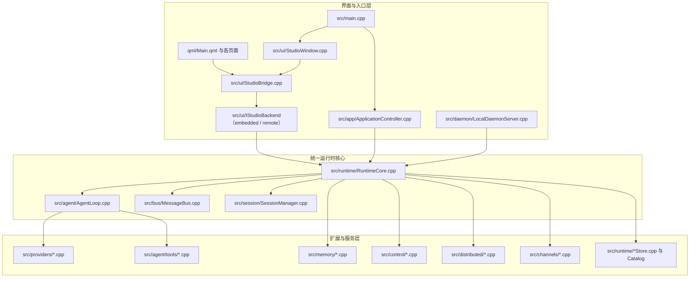

# YAOS 源码说明书

更新时间：2026-05-10  
适用版本：当前工作区 `C:\YAOS`  
说明：本文中的行号以当前源码为准，后续代码继续演进时会发生漂移，所以应优先按“文件 + 类/函数名”定位，再用行号做辅助。

## 1. 项目定位

YAOS 是一个用 C++ / Qt 构建的桌面 AI Runtime 与控制台系统。它不是单纯的聊天壳，而是把以下能力放进了同一套代码里：

1. 桌面 GUI 控制台
2. CLI 命令入口
3. 本地 IPC 守护进程 `yaosd`
4. 运行时 HTTP 服务 `runtime-service`
5. 记忆 HTTP 服务 `memory-service`
6. 控制平面 HTTP 服务 `control-service`
7. 多频道消息接入与回发
8. 子代理 / 分布式委派
9. 自动化 / 定时任务 / 心跳任务
10. 插件、技能、MCP 工具扩展

从代码结构上看，这个项目的核心不是 GUI，也不是某个 provider，而是 `RuntimeCore`。GUI、CLI、daemon、HTTP service 都只是不同入口，最后都尽量汇到同一个 runtime 逻辑。

## 2. 技术栈与构建产物

### 2.1 技术栈

- 语言：C++17
- 框架：Qt 5.14.2
- UI：QML + Qt Quick + Qt Quick Controls 2
- 网络：FastNet（OpenSSL 3），通过 `src/platform/network/FastNetHttpTransport` 和 `FastNetWebSocketTransport` 适配；禁止直接使用 `QTcpSocket` / `QNetworkAccessManager` / `QWebSocket`
- 本地 IPC：FastNet `TcpServer`（loopback TCP），不再使用 `QLocalServer` / `QLocalSocket`
- 存储：JSON / JSONL / SQLite（通过 `QtSql`）
- 构建：QMake（主力）+ CMake（并行，逐步迁移）+ `nmake`；入口脚本 `build.bat` / `cmake_build.bat`

### 2.2 当前代码规模

来自 `count_code_lines -d . --exclude-dirs release debug bin tmp` 的结果：

- 文件数：261
- 总行数：74210
- 代码行：65884
- 注释行：371
- 空行：7955

这个统计直接说明两件事：

1. 代码体量已经很大，且业务不是 demo 级别。
2. 注释明显偏少，理解成本主要依赖读代码本身。

### 2.3 主要构建目标

#### `YAOS.pro`

生成主程序 `yaos`。这是一个 Windows GUI 程序，但同时兼容 CLI 入口。Release 默认输出到 `bin/yaos.exe`，Debug 默认输出到 `bin/debug/yaos.exe`。  
入口文件：`src/main.cpp:147`

#### `yaosd.pro`

生成本地 daemon 程序 `yaosd`，走 `QLocalServer` 做本地 IPC。Release 默认输出到 `bin/yaosd.exe`。  
入口文件：`src/daemon/DaemonMain.cpp:13`

### 2.4 需要特别注意的运行方式

当前项目不是“一个 EXE 干一件事”，而是：

- `yaos.exe` 同时承载 GUI、CLI、runtime-service、memory-service、control-service
- `yaosd.exe` 是单独的本地 daemon
- `src/runtime/RuntimeServiceMain.cpp`、`src/memory/MemoryServiceMain.cpp`、`src/control/ControlServiceMain.cpp` 这类独立 service main 仍在仓库里，但当前工作区更常用的是 `yaos runtime-service` / `memory-service` / `control-service` 这条主二进制子命令路径
- 某些 auto-spawn 逻辑会优先尝试当前 `yaos.exe`，也兼容同目录下的 `yaos-runtime.exe` / `yaos-memory.exe` 风格程序名

也就是说，这个项目是“主二进制多角色 + 一个独立本地 sidecar”的结构。

## 3. 总体架构

一句话总结：

- `main.cpp` 决定“当前进程以 GUI、CLI、service 还是 regression 模式启动”
- `ApplicationController` 决定“CLI 子命令如何映射到具体业务”
- `RuntimeCore` 决定“系统真正如何初始化、编排、持久化和联动”
- `AgentLoop` 决定“单轮请求如何变成 provider 调用、tool 执行与结果输出”

## 4. 目录与详细文件树

### 4.1 文件树说明

下面这份文件树按“人工维护的源码与文档文件”整理，并且对每个列出的文件都写明职责。  
`bin/`、`debug/`、`release/` 里还有大量构建产物，不适合作为源码职责树逐个维护，因此只在末尾统一说明。

### 4.2 顶层文件

- `YAOS.pro`：主工程的 QMake 配置，定义 `yaos.exe` 的源码集合、Qt 模块、资源和构建参数。
- `yaosd.pro`：本地 daemon 工程的 QMake 配置，单独生成 `yaosd.exe`。
- `yaos_base.pro`：基础静态库工程，生成 `yaos_base.lib`。
- `yaos_business.pro`：业务静态库工程，生成 `yaos_business.lib`。
- `CMakeLists.txt`：并行 CMake 构建入口，读取同一套 `.pri` 文件，与 QMake 共享源码列表。
- `build.bat`：主构建脚本，按固定顺序构建 `yaos_base → yaos_business → yaos → yaosd`，默认执行架构边界检查和 runtime layout 检查。
- `cmake_build.bat`：CMake 构建入口脚本。
- `Makefile`：QMake 生成的默认构建脚本，供当前工程直接编译使用，不建议手工改业务逻辑。
- `Makefile.Release`：QMake 生成的 Release 构建脚本。
- `Makefile.Debug`：QMake 生成的 Debug 构建脚本。
- `startAll.cmd`：简化启动脚本，当前只是包装执行 `bin\yaos.exe gateway`。
- `YAOS.ico` / `yaos_resource.rc`：Windows 图标与资源脚本。
- `qml_qml_qmlcache.qrc`：QML cache 相关资源清单，属于构建相关文件。
- `.qmake.stash` / `YAOS.pro.user`：本地 qmake / Qt Creator 环境文件，不应作为业务源码修改。
- `README.md`：面向使用者的系统使用说明，讲安装、启动、GUI、CLI 与排错。
- `source.md`：面向开发者的源码说明文档，讲架构、链路、设计规则与改造方法。

### 4.3 顶层目录

- `src/`：全部手写 C++ 业务源码。
- `qml/`：全部 QML 界面、页面、组件和主题定义。
- `qmake/modules/`：QMake `.pri` 模块文件，定义各层源码集合（`base.pri`、`business.pri`、`frontend.pri`、`daemon.pri`），是 QMake 和 CMake 共享的源码边界契约。
- `scripts/`：PowerShell 检查脚本（`check_architecture.ps1`、`check_runtime_layout.ps1`）和辅助工具。
- `tests/`：集成 smoke 测试（`IntegrationSmoke.cpp`）。
- `docs/`：架构说明与评审文档。
- `assets/`：图标与资源文件。
- `bin/`：编译完成后的可执行文件与运行依赖。
- `debug/`：Qt Debug 生成目录，主要是生成物与调试构建输出。
- `release/`：Qt Release 生成目录，包含 moc、QML cache、qrc 等生成物。
- `tmp/`：临时分析文件目录，适合排查问题时落临时文本或统计结果。

### 4.4 `src/main.cpp`

- `src/main.cpp`：主程序入口，负责识别 GUI、CLI、runtime-service、memory-service、control-service 与 gui-regression 等启动模式。在 GUI 路径退出前调用 `FastNet::cleanup()` 释放 IO 线程。

### 4.4a `src/platform/network/`

- `src/platform/network/FastNetHttpTransport.h`：声明 FastNet HTTP 传输适配器接口，是项目唯一允许的 HTTP 客户端入口。
- `src/platform/network/FastNetHttpTransport.cpp`：实现基于 FastNet 的同步/异步 HTTP 请求，封装超时、重试和错误处理。
- `src/platform/network/FastNetWebSocketTransport.h`：声明 FastNet WebSocket 传输适配器接口。
- `src/platform/network/FastNetWebSocketTransport.cpp`：实现基于 FastNet 的 WebSocket 连接、消息收发和断线重连。
- `src/platform/network/FastNetLifecycle.h`：声明 FastNet 生命周期管理接口。
- `src/platform/network/FastNetLifecycle.cpp`：实现在 `QCoreApplication::aboutToQuit` 时调用 `FastNet::cleanup()`，避免进程退出后 IO 线程空转导致 CPU 占用。

### 4.5 `src/agent/`

- `src/agent/AgentLoop.h`：定义 Agent 主循环接口、流式输出回调、生命周期与执行状态。
- `src/agent/AgentLoop.cpp`：实现单轮 Agent 执行主链，串联上下文构建、provider 调用、tool 执行、审批和结果汇总。
- `src/agent/ContextBuilder.h`：定义上下文构建器接口，负责把会话、记忆、模板和任务元数据组装成模型输入。
- `src/agent/ContextBuilder.cpp`：实现上下文拼装逻辑，控制系统提示词、历史消息与附加资源如何进入推理请求。
- `src/agent/MemoryStore.h`：定义 Agent 侧记忆读写门面，屏蔽本地与远端 memory backend 的细节。
- `src/agent/MemoryStore.cpp`：实现 Agent 对记忆服务的检索、写入和摘要调用。
- `src/agent/Tool.h`：定义统一 Tool 抽象、参数描述、执行结果与错误结构，是模型可调用工具的基类协议。
- `src/agent/ToolRegistry.h`：定义 Tool 注册中心接口，负责按名字索引、启用和查找工具。
- `src/agent/ToolRegistry.cpp`：实现 Tool 容器、默认工具集注册与可用工具查询。
- `src/agent/Types.h`：定义 Agent 域共享的基础类型，例如消息块、执行统计与中间结果结构。

### 4.6 `src/agent/tools/`

- `src/agent/tools/CronTool.h`：定义自动化与定时任务相关 Tool 的接口。
- `src/agent/tools/CronTool.cpp`：实现模型对自动化、定时任务与计划项的创建、更新和触发操作。
- `src/agent/tools/ExecTool.h`：定义命令执行 Tool 的接口与安全参数。
- `src/agent/tools/ExecTool.cpp`：实现本地命令执行、输出采集和审批接入。
- `src/agent/tools/FileTools.h`：定义文件读写、搜索、补丁等文件工具接口。
- `src/agent/tools/FileTools.cpp`：实现文件读取、写入、搜索、目录枚举等文件系统能力。
- `src/agent/tools/MCPCallTool.h`：定义直接调用 MCP Tool 的接口。
- `src/agent/tools/MCPCallTool.cpp`：实现把单个 MCP Tool 暴露给 Agent 的调用桥。
- `src/agent/tools/MCPProxyTool.h`：定义 MCP 代理 Tool 的统一接口。
- `src/agent/tools/MCPProxyTool.cpp`：实现 MCP Server 聚合、参数转发和结果封装。
- `src/agent/tools/MessageTool.h`：定义消息投递 Tool 的接口。
- `src/agent/tools/MessageTool.cpp`：实现向频道、通知中心或内部消息总线发送消息的能力。
- `src/agent/tools/PluginTool.h`：定义插件驱动 Tool 的接口。
- `src/agent/tools/PluginTool.cpp`：实现把插件能力包装成 Agent 可调用 Tool。
- `src/agent/tools/SpawnTool.h`：定义子代理与委派 Tool 的接口。
- `src/agent/tools/SpawnTool.cpp`：实现本地子代理生成、委派提交与任务跟踪。
- `src/agent/tools/WebTools.h`：定义网页搜索、打开、截图等 Web Tool 的接口。
- `src/agent/tools/WebTools.cpp`：实现联网检索、网页读取和网页相关工具调用。

### 4.7 `src/app/`

- `src/app/ApplicationController.h`：声明 CLI 控制器接口、各子命令处理函数与输出辅助方法。
- `src/app/ApplicationController.cpp`：实现 CLI 命令分发、参数解析、状态展示、service 启动和各类子命令入口。

### 4.8 `src/bus/`

- `src/bus/Message.h`：定义统一消息对象，承载频道输入、内部转发与处理结果。
- `src/bus/MessageBus.h`：定义消息总线接口，负责消息注册、派发和订阅关系。
- `src/bus/MessageBus.cpp`：实现频道消息到 Agent 链路的统一转发总线。

### 4.9 `src/channels/`

- `src/channels/Channel.h`：定义所有消息频道适配器的统一抽象接口。
- `src/channels/ChannelManager.h`：声明频道管理器接口，统一持有和控制所有频道实例。
- `src/channels/ChannelManager.cpp`：实现频道初始化、生命周期管理、入站消息接线和出站回复分发。
- `src/channels/TelegramChannel.h`：声明 Telegram 频道适配器接口。
- `src/channels/TelegramChannel.cpp`：实现 Telegram 消息接入、发送与配置对接。
- `src/channels/SlackChannel.h`：声明 Slack 频道适配器接口。
- `src/channels/SlackChannel.cpp`：实现 Slack 消息收发与认证配置处理。
- `src/channels/MatrixChannel.h`：声明 Matrix 频道适配器接口。
- `src/channels/MatrixChannel.cpp`：实现 Matrix 协议侧的消息接入与回复逻辑。
- `src/channels/EmailChannel.h`：声明 Email 频道适配器接口。
- `src/channels/EmailChannel.cpp`：实现邮件轮询、解析和回信逻辑。
- `src/channels/QQChannel.h`：声明 QQ 频道适配器接口。
- `src/channels/QQChannel.cpp`：实现 QQ 平台接入与消息回发。
- `src/channels/FeishuChannel.h`：声明飞书频道适配器接口。
- `src/channels/FeishuChannel.cpp`：实现飞书平台接入、事件解析与消息回复。
- `src/channels/WhatsAppChannel.h`：声明 WhatsApp 频道适配器接口。
- `src/channels/WhatsAppChannel.cpp`：实现 WhatsApp 渠道的消息收发逻辑。
- `src/channels/DingTalkChannel.h`：声明钉钉频道适配器接口。
- `src/channels/DingTalkChannel.cpp`：实现钉钉平台消息协议适配。
- `src/channels/MochatChannel.h`：声明 Mochat 频道适配器接口。
- `src/channels/MochatChannel.cpp`：实现 Mochat 渠道的消息接入与发送。
- `src/channels/DiscordChannel.h`：声明 Discord 频道适配器接口。
- `src/channels/DiscordChannel.cpp`：实现 Discord 渠道的消息收发与配置联动。

### 4.10 `src/config/`

- `src/config/Config.h`：定义整个系统的配置模型，包括 provider、runtime、memory、channel、安全策略等所有配置结构体。
- `src/config/Config.cpp`：实现配置默认值、JSON 序列化、反序列化和兼容处理。
- `src/config/ConfigLoader.h`：声明配置文件装载与保存接口。
- `src/config/ConfigLoader.cpp`：实现配置文件读取、写回、错误处理与默认回退逻辑。
- `src/config/DelegationTemplateExchange.h`：定义委派模板导入导出接口。
- `src/config/DelegationTemplateExchange.cpp`：实现委派模板与外部 JSON 结构之间的转换。

### 4.11 `src/control/`

- `src/control/ControlHttpServer.h`：声明控制平面 HTTP 服务接口和路由处理能力。
- `src/control/ControlHttpServer.cpp`：实现控制平面 HTTP API，包括节点注册、心跳、解析与查询接口。
- `src/control/ControlServiceCore.h`：声明控制平面核心状态、节点健康与落盘接口。
- `src/control/ControlServiceCore.cpp`：实现节点注册表、健康快照与控制平面核心逻辑。
- `src/control/ControlServiceMain.cpp`：控制平面独立启动入口。

### 4.12 `src/daemon/`

- `src/daemon/DaemonMain.cpp`：本地 daemon 的独立入口，启动 `QLocalServer` 形式的 IPC 服务。
- `src/daemon/DaemonRuntimeClient.h`：声明 daemon 到 runtime 的桥接接口。
- `src/daemon/DaemonRuntimeClient.cpp`：实现 daemon 请求转发到 runtime 调用面的逻辑。
- `src/daemon/LocalDaemonProtocol.h`：定义本地 IPC 协议的 JSON 帧格式与命令结构。
- `src/daemon/LocalDaemonProtocol.cpp`：实现本地 IPC 协议编码与解码。
- `src/daemon/LocalDaemonServer.h`：声明本地 daemon 服务端接口。
- `src/daemon/LocalDaemonServer.cpp`：实现本地套接字监听、请求接收、协议解析与响应回写。

### 4.13 `src/distributed/`

- `src/distributed/Contracts.h`：定义分布式节点、任务、心跳、路由等共享契约结构。
- `src/distributed/ContractsJson.h`：声明分布式契约与 JSON 的互转接口。
- `src/distributed/ContractsJson.cpp`：实现分布式契约对象的 JSON 序列化与反序列化。
- `src/distributed/LocalNodeRegistry.h`：声明本地节点注册表接口。
- `src/distributed/LocalNodeRegistry.cpp`：实现本地节点视图、节点更新与查询逻辑。
- `src/distributed/LocalTaskBus.h`：声明本地任务总线接口。
- `src/distributed/LocalTaskBus.cpp`：实现单机或本地进程内任务投递与订阅。
- `src/distributed/P2PCluster.h`：声明点对点集群协调接口。
- `src/distributed/P2PCluster.cpp`：实现点对点节点发现、连接维护与集群关系同步。
- `src/distributed/RemoteControlClient.h`：声明远端控制平面客户端接口。
- `src/distributed/RemoteControlClient.cpp`：实现对 control-service 的 HTTP 请求与错误处理。
- `src/distributed/RemoteNodeRegistryClient.h`：声明远端节点注册表客户端接口。
- `src/distributed/RemoteNodeRegistryClient.cpp`：实现远端节点解析、拉取和缓存逻辑。
- `src/distributed/RemoteTaskBus.h`：声明远端任务总线客户端接口。
- `src/distributed/RemoteTaskBus.cpp`：实现跨节点任务投递、结果读取与失败处理。

### 4.14 `src/memory/`

- `src/memory/LayeredMemoryExporter.h`：声明分层记忆导出接口。
- `src/memory/LayeredMemoryExporter.cpp`：实现会话、事实、摘要等多层记忆导出与聚合。
- `src/memory/LocalMemoryIngestor.h`：声明本地记忆写入器接口。
- `src/memory/LocalMemoryIngestor.cpp`：实现本地分层记忆写入，负责写每日对话日志、生成每日摘要，并在需要时导出兼容的 `MEMORY.md` / `HISTORY.md`。
- `src/memory/LocalMemoryRetriever.h`：声明本地记忆检索器接口。
- `src/memory/LocalMemoryRetriever.cpp`：实现本地 recall，当前主要基于会话消息与事实做关键词重叠检索，并按新近性加权排序。
- `src/memory/MemoryBackend.h`：定义 memory backend 抽象接口，是本地 SQLite 与远端服务的共同协议。
- `src/memory/MemoryHttpServer.h`：声明记忆服务 HTTP 接口与路由分发器。
- `src/memory/MemoryHttpServer.cpp`：实现记忆服务 API，包括会话追加、检索、facts、recall 和 daily summary。
- `src/memory/MemoryRuntimeFactory.h`：声明记忆运行时工厂接口。
- `src/memory/MemoryRuntimeFactory.cpp`：按 `memory.mode` / `memory.backend` 构造本地或远端记忆运行时对象，并在远端不可用时回退到本地 store。
- `src/memory/MemoryServiceCore.h`：声明记忆服务核心对象、存储和业务方法。
- `src/memory/MemoryServiceCore.cpp`：实现记忆服务核心业务，协调 SQLite store、导出器和检索器。
- `src/memory/MemoryServiceMain.cpp`：记忆服务独立启动入口。
- `src/memory/MemoryServiceSupport.h`：声明记忆服务自动拉起、健康检查与接入辅助接口。
- `src/memory/MemoryServiceSupport.cpp`：实现记忆服务可用性探测与自动拉起辅助逻辑；状态探测只 probe，不直接 auto-spawn，真正创建远端 client 时才可能触发自动拉起。
- `src/memory/RemoteMemoryBackends.h`：声明远端记忆后端适配器接口。
- `src/memory/RemoteMemoryBackends.cpp`：实现把远端 memory-service 包装成 `MemoryBackend` 的适配层。
- `src/memory/RemoteMemoryClient.h`：声明远端记忆服务客户端接口。
- `src/memory/RemoteMemoryClient.cpp`：实现对远端记忆服务的 HTTP 调用。
- `src/memory/RemoteMemoryProtocol.h`：声明远端记忆协议的 DTO 与 JSON 映射接口。
- `src/memory/RemoteMemoryProtocol.cpp`：实现远端记忆请求与响应的协议转换。
- `src/memory/SqliteConversationStore.h`：声明会话 SQLite 存储接口。
- `src/memory/SqliteConversationStore.cpp`：实现对话历史的 SQLite 持久化。
- `src/memory/SqliteFactStore.h`：声明事实 SQLite 存储接口。
- `src/memory/SqliteFactStore.cpp`：实现结构化事实与检索索引的 SQLite 持久化。

### 4.15 `src/providers/`

- `src/providers/LLMProvider.h`：定义所有模型 Provider 的统一抽象接口、流式回调和返回结构。
- `src/providers/AnthropicProvider.h`：声明 Anthropic Provider 适配器接口。
- `src/providers/AnthropicProvider.cpp`：实现 Anthropic 协议侧的请求构造、发送和流式响应处理。
- `src/providers/EchoProvider.h`：声明回显 Provider 接口。
- `src/providers/EchoProvider.cpp`：实现调试或 fallback 用的 Echo Provider。
- `src/providers/OpenAICompatibleProvider.h`：声明 OpenAI 兼容 Provider 接口。
- `src/providers/OpenAICompatibleProvider.cpp`：实现 OpenAI 兼容 API 的请求构造、流式解析与错误处理。
- `src/providers/ProviderFactory.h`：声明 Provider 工厂接口。
- `src/providers/ProviderFactory.cpp`：实现按配置选择 Provider、凭据校验与 fallback 策略。
- `src/providers/ProviderOAuth.h`：声明 Provider OAuth 支持接口。
- `src/providers/ProviderOAuth.cpp`：实现 OAuth 回调、令牌交换与桌面登录支持。
- `src/providers/ProviderRegistry.h`：声明 Provider 元数据注册表接口。
- `src/providers/ProviderRegistry.cpp`：实现 Provider 规格、默认模型、默认 base URL 和路由规则维护。

### 4.16 `src/runtime/`

- `src/runtime/ApprovalStore.h`：声明审批记录存储接口。
- `src/runtime/ApprovalStore.cpp`：实现工具审批结果的 JSON 持久化。
- `src/runtime/AutomationStore.h`：声明自动化定义与运行记录存储接口。
- `src/runtime/AutomationStore.cpp`：实现自动化流程、运行历史和状态落盘。
- `src/runtime/CronService.h`：声明调度服务接口。
- `src/runtime/CronService.cpp`：实现定时扫描、自动化触发和周期任务调度。
- `src/runtime/EventLog.h`：声明事件日志接口。
- `src/runtime/EventLog.cpp`：实现 JSONL 事件追加写入。
- `src/runtime/ExtensionCatalog.h`：声明扩展目录扫描接口。
- `src/runtime/ExtensionCatalog.cpp`：实现扩展目录发现、元数据读取与整理。
- `src/runtime/HeartbeatService.h`：声明心跳任务服务接口。
- `src/runtime/HeartbeatService.cpp`：实现周期心跳任务生成、调度和 `HEARTBEAT.md` 维护。
- `src/runtime/LocalRuntimeClient.h`：声明本地运行时客户端接口。
- `src/runtime/LocalRuntimeClient.cpp`：实现对嵌入式 `RuntimeCore` 的本地调用封装。
- `src/runtime/MCPManager.h`：声明 MCP 管理器接口。
- `src/runtime/MCPManager.cpp`：实现 MCP Server 生命周期、资源发现和 Tool 暴露。
- `src/runtime/NotificationCenter.h`：声明通知中心接口。
- `src/runtime/NotificationCenter.cpp`：实现通知记录落盘与通知投递。
- `src/runtime/PluginRegistry.h`：声明插件注册表接口。
- `src/runtime/PluginRegistry.cpp`：实现插件目录扫描、manifest 读取和可用插件登记。
- `src/runtime/RemoteRuntimeClient.h`：声明远端 runtime-service 客户端接口。
- `src/runtime/RemoteRuntimeClient.cpp`：实现对远端 runtime-service 的 HTTP 调用与超时处理。
- `src/runtime/ResourceCatalog.h`：声明资源目录索引接口。
- `src/runtime/ResourceCatalog.cpp`：实现工作区资源扫描、缓存与分类整理。
- `src/runtime/RuntimeClientFacade.h`：声明运行时客户端统一门面接口。
- `src/runtime/RuntimeClientFacade.cpp`：实现本地 runtime、远端 runtime 与 daemon 路径的统一选择。
- `src/runtime/RuntimeCore.h`：声明运行时核心对象、状态快照、任务编排和对外业务接口。
- `src/runtime/RuntimeCore.cpp`：实现系统初始化、Agent 编排、委派、频道、自动化、健康检查和主要业务逻辑。
- `src/runtime/RuntimeFacade.h`：声明面向 GUI 和上层控制器的运行时门面接口。
- `src/runtime/RuntimeFacade.cpp`：实现对 `RuntimeCore` 的高层封装，简化 UI/CLI 接入。
- `src/runtime/RuntimeHttpServer.h`：声明 runtime-service HTTP 服务接口。
- `src/runtime/RuntimeHttpServer.cpp`：实现 runtime-service 的 `/health`、`/v1/runtime/invoke` 等接口。
- `src/runtime/RuntimeSerialization.h`：声明运行时领域对象与 JSON 互转接口。
- `src/runtime/RuntimeSerialization.cpp`：实现任务、状态、快照和运行结果的 JSON 序列化。
- `src/runtime/RuntimeServiceMain.cpp`：runtime-service 独立启动入口。
- `src/runtime/RuntimeServiceSupport.h`：声明 runtime-service 自动拉起与探测支持接口。
- `src/runtime/RuntimeServiceSupport.cpp`：实现 runtime-service 健康检查、端点探测和自动拉起辅助逻辑。
- `src/runtime/RuntimeTypes.h`：定义运行时领域共享类型，例如状态快照、任务、路由结果与配置视图。
- `src/runtime/SkillRegistry.h`：声明技能注册表接口。
- `src/runtime/SkillRegistry.cpp`：实现技能目录扫描、Skill 元数据读取和可用技能登记。
- `src/runtime/StructuredLog.h`：声明结构化日志接口。
- `src/runtime/StructuredLog.cpp`：实现结构化日志写入与日志对象规范化。
- `src/runtime/SubagentManager.h`：声明子代理管理器接口。
- `src/runtime/SubagentManager.cpp`：实现子代理创建、跟踪、结果合并与回收。
- `src/runtime/TaskStore.h`：声明任务存储接口。
- `src/runtime/TaskStore.cpp`：实现主任务与子任务的 JSON 持久化。
- `src/runtime/Templates.h`：声明模板仓库接口。
- `src/runtime/Templates.cpp`：实现内建模板、提示模板和相关资源的加载。

### 4.17 `src/session/`

- `src/session/SessionManager.h`：声明会话管理器接口。
- `src/session/SessionManager.cpp`：实现当前会话状态、会话切换和会话持久化关联。

### 4.18 `src/ui/`

- `src/ui/StudioBackendTypes.h`：定义 `IStudioBackend` 接口、`StudioBackendSelection`、`StudioConfigSaveResult` 等 backend 层共享类型。
- `src/ui/StudioBackend.h`：声明 `IStudioBackend` 接口和 `RuntimeFacadeStudioBackend` 基础实现。
- `src/ui/StudioBackend.cpp`：实现 embedded 模式下的 `RuntimeFacadeStudioBackend`，以及 `createStudioBackend` 工厂函数（根据 runtime mode 选择 embedded 或 remote backend）。
- `src/ui/StudioBackend_p.h`：backend 层内部 helper 声明，包含 `providerConfigById` inline 转发等私有辅助函数。
- `src/ui/StudioBackendDto.cpp`：实现 runtime 领域对象到 QVariantMap DTO 的转换，集中维护 `statusToVariant` 等序列化函数。
- `src/ui/StudioProviderBackend.cpp`：实现 provider 模型同步、默认路由选择等 provider 相关 backend 方法。
- `src/ui/StudioOAuthBackend.cpp`：实现 OAuth 状态查询、device flow、browser flow、refresh、logout 等 OAuth 相关 backend 方法。
- `src/ui/StudioControlBackend.cpp`：实现 control plane delegation template push/pull 等控制平面相关 backend 方法。
- `src/ui/StudioAutomationBackend.cpp`：实现自动化 CRUD、运行触发等自动化相关 backend 方法。
- `src/ui/RemoteStudioBackend.cpp`：实现 `RemoteStudioBackend`，在 daemon/remote 模式下通过 `studio.*` invoke 协议把 provider、OAuth、config、extension 等业务操作转发到 runtime 端执行。
- `src/ui/GuiRegressionRunner.h`：声明 GUI 回归执行器接口。
- `src/ui/GuiRegressionRunner.cpp`：实现 GUI regression 模式的自动化执行逻辑。
- `src/ui/OAuthLoopbackServer.h`：声明桌面 OAuth 回调本地监听器接口。
- `src/ui/OAuthLoopbackServer.cpp`：实现本地回调端口监听与 OAuth 授权码接收。
- `src/ui/StudioBridge.h`：声明 QML 与 C++ 的桥接接口，暴露配置、状态和操作能力。
- `src/ui/StudioBridge.cpp`：实现 QML 调用面、配置草稿读写、状态刷新和启动流程编排；持有 `IStudioBackend` 实例，通过 backend 接口访问业务能力，不直接操作 runtime 内部对象。
- `src/ui/StudioWindow.h`：声明桌面主窗口封装接口。
- `src/ui/StudioWindow.cpp`：实现主窗口、QML 引擎、启动画面与桌面集成逻辑。

### 4.19 `qml/`

- `qml/Main.qml`：主界面壳层，负责导航、页面装载、草稿配置、全局状态和页面间共享函数。
- `qml/Startup.qml`：启动页，负责首屏加载动画、初始化进度与启动阶段提示。
- `qml/logic/*.js`：QML 侧的轻量领域逻辑，当前包括自动化、委托模板、provider、runtime 导航与 runtime 状态辅助模块。

### 4.20 `qml/components/`

- `qml/components/ActionButton.qml`：统一操作按钮组件，封装项目级按钮视觉与交互风格。
- `qml/components/GlassArea.qml`：毛玻璃风格容器组件，用于页面中的半透明区域承载。
- `qml/components/GlassField.qml`：带玻璃风格的输入框组件。
- `qml/components/NavChip.qml`：左侧导航或页签使用的导航条目组件。
- `qml/components/NeoCard.qml`：统一卡片容器组件，封装标题、边框与间距风格。
- `qml/components/NeoCheckBox.qml`：统一复选框组件。
- `qml/components/NeoComboBox.qml`：统一下拉框组件。
- `qml/components/NeoIcon.qml`：统一图标组件，屏蔽图标大小、颜色和语义图标选择。
- `qml/components/PageHero.qml`：页面顶部 Hero 区组件，用于显示页面标题、副标题和状态摘要。
- `qml/components/ReadOnlyTextView.qml`：只读文本展示组件，适合日志、输出和长文本查看。
- `qml/components/ResponsiveCardGrid.qml`：响应式卡片网格布局组件。
- `qml/components/ResponsiveGridStrip.qml`：响应式横向或分栏网格布局组件。
- `qml/components/WindowControlButton.qml`：自定义窗口标题栏控制按钮组件。
- `qml/components/DelegationTemplateCard.qml`：委托模板管理卡，负责模板保存、导入导出、推送拉取和与控制平面同步。
- `qml/components/DelegationDraftCard.qml`：单任务委托草稿卡，负责委托请求编辑、预演和提交。
- `qml/components/BatchDelegationDraftCard.qml`：批量委托草稿卡，负责多任务批量委托编辑与导出。
- `qml/components/NodeDirectoryCard.qml`：节点目录卡，展示节点状态、标签、角色和在线情况。
- `qml/components/RoutingDiagnosticsCard.qml`：路由诊断卡，用于预览委托路由结果和候选节点。
- `qml/components/AgentCoreCard.qml`：Agent Core 配置卡，负责默认工作区、模型与推理参数。
- `qml/components/GatewayCard.qml`：Gateway 配置卡，负责 host、port、heartbeat 等网关配置。
- `qml/components/RuntimeTopologyCard.qml`：运行拓扑卡，负责 embedded / daemon / remote、control plane 与 auto-spawn 策略。
- `qml/components/MemoryPlaneCard.qml`：记忆平面卡，负责 `memory.mode`、`memory.backend`、`recentWindow`、`retrievalTopK`、每日摘要、远端记忆服务 endpoint / timeout / auto-spawn 等配置与状态展示。
- `qml/components/ToolCapabilitiesCard.qml`：工具能力配置卡，负责 web/filesystem/exec/messaging/spawn/cron/mcp 等能力开关。
- `qml/components/WebSearchCard.qml`：Web Search 配置卡，负责 provider、代理和结果数限制。
- `qml/components/RuntimePageCoordinator.qml`：Runtime 页协调器，封装卡片间联动、预演桥接和页面级状态同步。
- `qml/components/RuntimeSectionLinkButton.qml`：Runtime 页 section 快捷跳转按钮组件。
- `qml/components/RuntimeSectionQuickLinks.qml`：Runtime 页 section 快捷链接容器组件。

### 4.21 `qml/pages/`

- `qml/pages/AutomationPage.qml`：自动化页面，展示和编辑自动化任务、计划与运行状态。
- `qml/pages/ChannelsPage.qml`：频道页面，配置各平台接入参数并显示频道状态。
- `qml/pages/ChatPage.qml`：聊天页面，是桌面端最直接的对话与任务执行入口。
- `qml/pages/ExtensionsPage.qml`：扩展页面，展示插件、技能与扩展能力。
- `qml/pages/ModelsPage.qml`：模型页面，用于配置 Provider、模型、凭据和默认路由。
- `qml/pages/OverviewPage.qml`：总览页面，展示系统运行状态、组件健康和关键摘要。
- `qml/pages/ResourcesPage.qml`：资源页面，用于查看工作区资源目录和资源索引。
- `qml/pages/RuntimePage.qml`：运行时页面，用于配置 runtime、memory、control、端点与自动拉起策略。
- `qml/pages/SecurityPage.qml`：安全页面，用于配置工具能力、审批策略和风险控制项。

### 4.22 `qml/theme/`

- `qml/theme/ComponentTheme.qml`：组件级主题出口，聚合组件所需的视觉 token。
- `qml/theme/Foundation.qml`：基础设计 token，定义间距、圆角、字号和基础尺寸。
- `qml/theme/IconRegistry.qml`：图标名称与图标资源的统一注册表。
- `qml/theme/Palette.qml`：基础颜色盘定义。
- `qml/theme/SemanticTokens.qml`：语义化颜色和状态 token 定义。
- `qml/theme/Theme.qml`：最终主题出口，把基础 token、语义 token 和组件 token 组合成统一主题对象。

### 4.23 QML 缓存与生成文件

- 当前仓库里没有手写维护的 `.qmlc` 源文件；QML cache 主要以 `release/qml_*_qml.cpp`、`release/qmlcache_loader.cpp`、`release/qrc_qml_qml_qmlcache.cpp` 和顶层 `qml_qml_qmlcache.qrc` 的形式出现。
- 这些文件都属于构建输出或构建相关清单，不要在里面修改业务逻辑。

### 4.24 生成与输出目录的意义

- `bin/`：编译完成后的可执行文件、动态库和运行依赖目录。
- `release/`：Qt Release 生成目录，常见内容包括 `moc_*.cpp`、`qml_*_qml.cpp` 和资源编译文件。
- `debug/`：Qt Debug 生成目录，内容与 `release/` 类似，但带调试构建参数。
- `tmp/`：人工排查、统计输出和临时文件的安全落点。

`release/` 和 `debug/` 里的 `moc_*.cpp`、`qml_*_qml.cpp`、自动生成的缓存文件都不是手写业务代码，不要在这些文件里改逻辑。

## 5. 各模块职责

### 5.1 `main.cpp`

主职责是“判定启动模式”，而不是处理业务。

关键点：

- `src/main.cpp:147`：主入口
- `src/main.cpp:171`：读取命令行参数
- `src/main.cpp:179`：判定是否启动 GUI
- `src/main.cpp:235`：CLI 模式交给 `ApplicationController`

它解决的问题：

1. Windows GUI 程序如何兼容 CLI 控制台
2. 什么时候打开桌面窗口
3. 什么时候走 CLI
4. 什么时候跑 gui-regression

### 5.2 `ApplicationController`

它是命令分发层，不负责真正执行业务算法。

关键点：

- `src/app/ApplicationController.cpp:1219`：CLI 命令分发总入口
- `src/app/ApplicationController.cpp:2234`：`route-preview`
- `src/app/ApplicationController.cpp:2780`：`agent`
- `src/app/ApplicationController.cpp:2967`：`runtime-service`

它负责：

1. 把命令行子命令映射到对应函数
2. 把 CLI 输出格式化成人可读文本
3. 为 GUI / CLI / service 复用 `RuntimeCore`

### 5.3 `RuntimeCore`

这是项目最核心、最重、也最需要谨慎改动的类。

关键点：

- `src/runtime/RuntimeCore.cpp:1169`：状态快照
- `src/runtime/RuntimeCore.cpp:1449`：委派路由预览
- `src/runtime/RuntimeCore.cpp:2267`：单轮消息处理
- `src/runtime/RuntimeCore.cpp:2526`：runtime 初始化
- `src/runtime/RuntimeCore.cpp:2883`：service health
- `src/runtime/RuntimeCore.cpp:2914`：提交委派子代理
- `src/runtime/RuntimeCore.cpp:3268`：委派目标解析
- `src/runtime/RuntimeCore.cpp:3967`：自动化调度对齐
- `src/runtime/RuntimeCore.cpp:4035`：runtime teardown

它负责：

1. 初始化 provider / agent / bus / stores / services
2. 处理消息轮次
3. 管理任务、审批、事件、通知、资源
4. 管理委派、节点、control plane、task bus
5. 管理自动化和心跳
6. 给 GUI / HTTP / daemon 提供统一 runtime 能力

### 5.4 `AgentLoop`

`AgentLoop` 才是真正的“对话执行器”。

关键点：

- `src/agent/AgentLoop.cpp:181`：构造函数，绑定 bus 与 memory 组件
- `src/agent/AgentLoop.cpp:244`：注册默认工具
- `src/agent/AgentLoop.cpp:332`：`processDirect`
- `src/agent/AgentLoop.cpp:525`：provider fallback 拒绝逻辑

它负责：

1. 组装当前轮消息
2. 调用 provider
3. 执行工具调用
4. 保存 session / conversation / heuristic facts
5. 生成最终出站消息

### 5.5 `memory/*`

这一层把“会话消息、事实、召回、总结、远端记忆服务”封装起来。

关键点：

- `src/memory/MemoryServiceCore.cpp:23`：记忆服务核心构造
- `src/memory/MemoryHttpServer.cpp:162`：HTTP 请求分发
- `src/memory/MemoryHttpServer.cpp:243`：append conversation
- `src/memory/MemoryServiceSupport.cpp:139`：本地/远端记忆服务可用性探测

### 5.6 `control/*` 与 `distributed/*`

这两层解决“节点注册、节点健康、路由解析、任务总线、P2P fallback、远端 control plane”问题。

关键点：

- `src/control/ControlServiceCore.cpp`：节点目录、健康快照、解析规则
- `src/control/ControlHttpServer.cpp:240`：节点发布 API
- `src/control/ControlHttpServer.cpp:257`：节点列表 API
- `src/distributed/P2PCluster.*`：本地/局部 P2P 集群
- `src/distributed/RemoteTaskBus.*`：远端任务总线

### 5.7 `channels/*`

统一管理外部消息平台。

关键点：

- `src/channels/ChannelManager.cpp:25`：根据配置初始化已启用频道
- `src/channels/ChannelManager.cpp:106`：分发出站消息
- `src/channels/ChannelManager.cpp:123`：处理进度提示 / 工具提示的过滤

### 5.8 `ui/*` + `qml/*`

GUI 不是直接碰 runtime 的，而是通过 `StudioBridge` → `IStudioBackend` 两层边界访问业务能力。

`IStudioBackend` 有两个实现：
- `RuntimeFacadeStudioBackend`：embedded 模式，直接调用进程内 `RuntimeCore`
- `RemoteStudioBackend`：daemon/remote 模式，通过 `studio.*` invoke 协议把请求转发到 runtime 端

关键点：

- `src/ui/StudioWindow.cpp:116`：窗口初始化与 `Startup.qml` 装载
- `src/ui/StudioBridge.cpp:816`：7 秒刷新定时器
- `src/ui/StudioBridge.cpp:1018`：分步刷新流程
- `src/ui/StudioBridge.cpp:1526`：保存配置
- `src/ui/StudioBackend.cpp`：`createStudioBackend` 工厂，根据 runtime mode 选择 backend
- `src/runtime/LocalRuntimeClient.cpp`：`studio.*` invoke handler，daemon/remote 模式下的业务执行端
- `qml/Startup.qml:60`：Main.qml 异步装载
- `qml/Main.qml:2902`：左侧导航
- `qml/Main.qml:3219`：Runtime 页 loader

## 6. 业务实现流程

### 6.1 GUI 启动流程

1. `src/main.cpp:147` 创建 `QGuiApplication`
2. `src/main.cpp:179` 判断当前命令是否应打开 GUI
3. `src/ui/StudioWindow.cpp:116` 创建 `StudioBridge`
4. `src/ui/StudioWindow.cpp:165` 先加载 `qrc:/qml/Startup.qml`
5. `qml/Startup.qml:60` 异步加载 `Main.qml`
6. `src/ui/StudioBridge.cpp:901` 开始 staged bootstrap
7. `src/ui/StudioBridge.cpp:1018` 按步骤刷新状态、任务、事件、节点、资源
8. `qml/Main.qml` 根据 `studioBridge` 暴露的数据绘制页面

### 6.2 CLI 启动流程

1. `src/main.cpp:232` 处理控制台绑定
2. `src/main.cpp:235` 创建 `ApplicationController`
3. `src/app/ApplicationController.cpp:1219` 分发 CLI 子命令
4. 命令最终调用 `RuntimeCore` 或相关 service 核心类

### 6.3 单次对话处理流程

1. `ApplicationController::agent` 在 `src/app/ApplicationController.cpp:2780`
2. 先通过 `RuntimeCore::serviceHealth` 校验 provider 是否真的可用：`src/runtime/RuntimeCore.cpp:2883`
3. `RuntimeCore::processMessageDetailed` 在 `src/runtime/RuntimeCore.cpp:2267` 建立任务记录、trace、session 上下文
4. 如果 runtime 未初始化，则 `RuntimeCore::ensureInitialized` 在 `src/runtime/RuntimeCore.cpp:2526` 完成初始化
5. `RuntimeCore::invokeProcessDirect` 在 `src/runtime/RuntimeCore.cpp:2485` 把调用切到 agent 专属线程
6. `AgentLoop::processDirect` 在 `src/agent/AgentLoop.cpp:332` 把请求包成 `InboundMessage`
7. `AgentLoop::processMessage` 内部构建上下文、历史消息、memory recall、skill overrides
8. provider 执行 `chat`
9. 若返回 tool call，则由 `ToolRegistry` 逐个执行工具
10. 若工具需要审批，由 `RuntimeCore` 提供的 tool guard 拦截，审批记录进入 `ApprovalStore`
11. 本轮完成后，结果写回任务、事件、通知
12. 需要时再通过 `ChannelManager` 投递到外部渠道

### 6.4 Runtime 初始化流程

起点：`src/runtime/RuntimeCore.cpp:2526`

初始化顺序大致是：

1. 读取配置，应用 model / provider override
2. 同步工作区模板，初始化系统 store
3. 创建内部 `MessageBus`
4. 尝试连接远端 registry / remote task bus
5. 如果远端不完整，则回退本地 `P2PCluster`
6. 选择 provider：`src/providers/ProviderFactory.cpp:77`
7. 构建 `CronService`、`MCPManager`、`SubagentManager`
8. 构建 `AgentLoop`
9. 启动 `AgentThread`
10. 同步注册默认工具：`src/runtime/RuntimeCore.cpp:2698`
11. 绑定 subagent / cron / heartbeat / channels 回调
12. 对齐自动化调度：`src/runtime/RuntimeCore.cpp:3967`
13. 发布节点 presence

### 6.5 Provider 选择流程

起点：`src/providers/ProviderFactory.cpp:77`

1. 根据 `Config::matchedProviderName(model)` 推导 provider
2. 规范化 provider 名称
3. 从配置中取 provider 配置
4. 从 OAuth 状态中补充 access token / headers / api base
5. 如果凭据不完整且该 provider 不允许空 key，则 fallback 到 `EchoProvider`
6. Anthropic 走独立实现，其他大部分走 `OpenAICompatibleProvider`

当前设计规则非常重要：

- provider 不可用时，底层可以 fallback 到 echo
- 但 `AgentLoop` 和 `RuntimeCore::serviceHealth` 会拒绝“静默回退”
- 也就是“回退存在，但默认不允许伪装成目标 provider 成功”

### 6.6 工具审批与审计流程

1. 工具注册在 `src/agent/AgentLoop.cpp:244`
2. 审批策略来自 `Config.security.toolPolicies`
3. `RuntimeCore` 在初始化 agent 时注入 `setToolGuard`
4. 需要确认的动作写入 `ApprovalStore`：`src/runtime/ApprovalStore.h:28`
5. 审批通过后会消耗 grant，再次执行时直接放行
6. 调用结果进入事件日志和通知中心

### 6.7 记忆链路

#### 传统摘要记忆

1. `memory.mode = legacy` 时，主要使用 `src/agent/MemoryStore.cpp`
2. 长期摘要写到 `memory/MEMORY.md`
3. 原始归档写到 `memory/HISTORY.md`
4. 这条链路更接近“对话压缩归档”，不是结构化 fact / recall 系统

#### 分层本地记忆

起点：`src/memory/MemoryRuntimeFactory.cpp:163` 与 `src/agent/AgentLoop.cpp:487`

1. `MemoryRuntimeFactory` 按配置创建 `SqliteConversationStore`、`SqliteFactStore`、`LocalMemoryRetriever`、`LocalMemoryIngestor`
2. 每轮发给模型前，`AgentLoop` 会按 `memory.recentWindow` 和 `memory.retrievalTopK` 组装 `MemoryQuery`
3. `LocalMemoryRetriever` 先查 facts，再查当前 session 的历史消息，并按关键词重叠与新近性排序
4. 当前 `recentWindow` 虽然 UI 文案写成“小时”，实现上实际是“排除最近 N 条消息不参与 recall”
5. 每轮落盘时，Agent 会先追加会话，再抽取启发式 facts，再调用 `LocalMemoryIngestor`
6. `LocalMemoryIngestor` 会写 `memory/daily/*.md`、生成 `memory/daily/*.summary.md`，并在启用导出时回写 `memory/MEMORY.md` / `memory/HISTORY.md`

#### 远端记忆服务

1. `MemoryServiceSupport::ensureMemoryService()` 先根据 `memory.backend`、`memory.service.enabled` 和各 store driver 判断是否偏好远端服务
2. `RuntimeCore` 做状态快照时调用 `ensureMemoryService(cfg, false, ...)`，因此这里只探测可达性，不自动拉起
3. `MemoryRuntimeFactory::createRemoteClient()` 调用 `ensureMemoryService(config, true)`，真正走远端记忆后端时才允许 auto-spawn
4. auto-spawn 还要求 endpoint 是本机地址、`memory.service.autoSpawnLocalService = true`，并且能找到 `yaos.exe memory-service` 或同目录 `yaos-memory.exe`
5. 远端 HTTP API 由 `src/memory/MemoryHttpServer.cpp` 提供

### 6.8 多频道收发链

1. `ChannelManager` 在 `src/channels/ChannelManager.cpp:31` 根据配置注册各频道
2. 各频道实现自己的 `start / stop / send`
3. 外部消息进来后，频道类向 `MessageBus` 发布 inbound
4. `AgentLoop::onInboundMessage` 在 `src/agent/AgentLoop.cpp:319` 接住消息并处理
5. 回答通过 `MessageBus::publishOutbound`
6. `ChannelManager::handleOutbound` 在 `src/channels/ChannelManager.cpp:123` 过滤掉不该发的进度或工具提示
7. 最终 `dispatch` 到对应平台

### 6.9 子代理 / 委派 / 集群链路

#### 本地子代理

1. `SpawnTool` 触发 `SubagentManager`
2. `SubagentManager::spawnSingle` 在 `src/runtime/SubagentManager.cpp:31`
3. 如果没有指定远端条件，就用 `QtConcurrent` 本地异步跑

#### 委派子代理

1. 预览路由：`src/runtime/RuntimeCore.cpp:1449`
2. 真正提交：`src/runtime/RuntimeCore.cpp:2914`
3. 节点解析：`src/runtime/RuntimeCore.cpp:3268`
4. 若 control plane 可用，则优先远端解析
5. 否则回退本地 registry / P2P

当前版本的一个重要规则是：

- registry 和 task bus 必须尽量在同一个 transport 平面
- 不允许“registry 远端、task bus 本地”的分裂状态继续工作

### 6.10 自动化与定时任务流程

#### 自动化存储

- 自动化定义：`src/runtime/AutomationStore.cpp:68` -> `automations/flows.json`
- 自动化运行记录：`src/runtime/AutomationStore.cpp:317` -> `automations/runs.json`

#### 执行流程

1. `AutomationStore` 保存自动化元数据
2. `RuntimeCore::reconcileAutomationSchedules` 在 `src/runtime/RuntimeCore.cpp:3967` 对齐 cron 作业
3. `CronService` 在 `src/runtime/CronService.cpp:166` 负责定时触发
4. 触发后再回到 `RuntimeCore::processMessageDetailed`
5. 结果写入 automation run store 与事件日志

### 6.11 Heartbeat 流程

起点：`src/runtime/HeartbeatService.cpp:13`

1. 定时读取 `HEARTBEAT.md`：`src/runtime/HeartbeatService.cpp:76`
2. 先让 provider 判断是否需要运行
3. 如果 provider 没返回结构化决策，则 fallback 到扫描 `- [ ]` 未完成项
4. 若需要执行，则通过回调进入 runtime 消息链
5. 若产生结果，再通过 notify 回调发回频道

### 6.12 Runtime HTTP service 流程

1. CLI 子命令入口：`src/app/ApplicationController.cpp:2967`
2. 或独立入口：`src/runtime/RuntimeServiceMain.cpp:107`
3. 启动前先做 `serviceHealth` 检查
4. 通过 `LocalRuntimeClient` 暴露 runtime 方法：`src/runtime/LocalRuntimeClient.cpp:52`
5. `RuntimeHttpServer` 提供 `/health` 与 `/v1/runtime/invoke`：`src/runtime/RuntimeHttpServer.cpp:196`

### 6.13 Memory HTTP service 流程

1. 服务核心：`src/memory/MemoryServiceCore.cpp:23`
2. HTTP 分发：`src/memory/MemoryHttpServer.cpp:162`
3. 健康检查：`GET /health`
4. 数据接口：
   - append conversation：`src/memory/MemoryHttpServer.cpp:243`
   - recent conversation：`src/memory/MemoryHttpServer.cpp:258`
   - facts / recall / ingest / daily summary：在同文件后续分支

### 6.14 Control plane 流程

1. 服务核心：`src/control/ControlServiceCore.cpp`
2. 健康快照路径：`src/control/ControlServiceCore.cpp:36` -> `runtime/control_node_health.json`
3. HTTP 分发：`src/control/ControlHttpServer.cpp:161`
4. 核心接口：
   - 节点 publish/register/heartbeat：`src/control/ControlHttpServer.cpp:240`
   - 节点 list：`src/control/ControlHttpServer.cpp:257`
   - 其他 resolve / task bus / node detail 在同文件后续分支

### 6.15 本地 daemon 流程

1. `yaosd` 入口：`src/daemon/DaemonMain.cpp:13`
2. `LocalDaemonServer` 在 `src/daemon/LocalDaemonServer.cpp:23` 启动
3. 通过 FastNet `TcpServer` 监听 loopback TCP 端口（端口号由 `LocalDaemonProtocol::serverPort` 根据 server name 哈希确定）
4. 接收 JSON 帧，转发给 `LocalRuntimeClient`
5. 返回 JSON 响应
6. `DaemonRuntimeClient` 在 GUI 端负责连接 daemon，连接失败时自动 spawn `yaosd.exe` 并重试

## 7. 数据落盘与运行目录

默认配置目录：

- `~/.yaos/config.json`

默认工作区：

- `~/.yaos/workspace`

核心落盘点：

| 数据 | 路径 | 代码落点 |
| --- | --- | --- |
| 配置 | `.yaos/config.json` | `src/config/ConfigLoader.cpp:36` |
| 任务 | `workspace/runtime/tasks.json` | `src/runtime/TaskStore.cpp:141` |
| 审批 | `workspace/runtime/approvals.json` | `src/runtime/ApprovalStore.cpp:39` |
| 事件 | `workspace/runtime/events.jsonl` | `src/runtime/EventLog.cpp:16` |
| 通知 | `workspace/runtime/notifications.json` | `src/runtime/NotificationCenter.cpp:19` |
| 自动化定义 | `workspace/automations/flows.json` | `src/runtime/AutomationStore.cpp:69` |
| 自动化运行记录 | `workspace/automations/runs.json` | `src/runtime/AutomationStore.cpp:317` |
| 会话 SQLite | `workspace/runtime/conversations.sqlite` | `src/memory/MemoryServiceCore.cpp:27` |
| 事实 SQLite | `workspace/runtime/facts.sqlite` | `src/memory/MemoryServiceCore.cpp:30` |
| control 节点健康快照 | `workspace/runtime/control_node_health.json` | `src/control/ControlServiceCore.cpp:36` |
| 本地插件目录 | `workspace/plugins` | `src/runtime/PluginRegistry.cpp:88` |
| 本地技能目录 | `workspace/skills` | `src/runtime/SkillRegistry.cpp:185` |
| 心跳任务文件 | `workspace/HEARTBEAT.md` | `src/runtime/HeartbeatService.cpp:76` |

## 8. 设计规则

### 8.1 单一真实业务核心

GUI、CLI、daemon、HTTP service 都尽量复用 `RuntimeCore`。  
如果一个新功能只写在 GUI 或只写在 CLI，而没有进入 `RuntimeCore` / service core，后续一定会重复实现。

### 8.2 配置优先，运行时派生

- 静态配置放 `Config`
- 运行时状态放 `StatusSnapshot`、stores、health probe
- GUI 页面的字段本质上是 `Config` 的编辑器，而不是直接改内部对象

### 8.3 UI 草稿编辑规则

QML 不是直接写磁盘，而是：

1. `qml/Main.qml` 中通过 `read(...)` 和 `assign(...)` 操作 `draftConfig`
2. `StudioBridge::saveConfig` 在 `src/ui/StudioBridge.cpp:1526` 把草稿传给 `IStudioBackend::saveConfiguration`
3. embedded 模式：`RuntimeFacadeStudioBackend` 负责 preserve live OAuth state、`ConfigLoader::save` 写盘、重建 runtime facade
4. daemon/remote 模式：`RemoteStudioBackend` 通过 `studio.saveConfiguration` invoke 把保存操作转发到 runtime 端执行
5. 保存结果以 DTO 返回，`StudioBridge` 根据结果更新 `m_config` 并替换 backend 实例

所以"加一个配置字段"必须同时改：

- `Config.h`
- `Config.cpp`
- QML 读写
- `StudioBridge::saveConfig`（如果需要特殊处理）

### 8.4 线程规则

- GUI 主线程：窗口、QML、bridge
- AgentThread：`AgentLoop`
- 异步子任务：`QtConcurrent`

当前版本已经把 `AgentLoop` 的析构收敛到所属线程内执行，这是必须遵守的规则；不要再把 agent 相关 QObject 直接跨线程析构。

### 8.5 Fallback 规则

系统允许 provider fallback 到 echo，但不允许业务层“假装目标 provider 正常可用”。  
因此新代码里如果直接拿 `ProviderFactory` 返回结果使用，必须同时考虑：

1. `isFallback()`
2. `requestedProvider`
3. health / UI / CLI 的错误语义

### 8.6 健康检查规则

“端口监听成功”不等于“服务真正可用”。  
新服务健康接口应该至少包含：

1. initialized
2. requested backend
3. actual backend
4. fallback 状态
5. 错误信息

### 8.7 本地优先 / 远端可选

项目整体倾向是：

1. 本地先能跑起来
2. 远端 runtime / memory / control 是可选增强
3. control plane 失联后有 fallback

但远端与本地不能出现“逻辑平面不一致”的混搭。

### 8.8 持久化规则

大多数 store 用 JSON / JSONL + `QSaveFile`。  
优点是直接、可读、可迁移；缺点是并发和体量扩大后会变重。

## 9. 添加或修改功能的操作手册

## 9.1 新增一个 CLI 子命令

修改点：

1. `src/app/ApplicationController.h`：声明新方法
2. `src/app/ApplicationController.cpp:1219`：在 `run()` 里注册分支
3. `src/app/ApplicationController.cpp`：实现命令函数
4. 如果这个命令需要在 GUI 启动阶段特殊处理，再改 `src/main.cpp:171-185`

做法：

1. 先决定它是纯 CLI 命令，还是也需要 GUI 入口
2. 如果只是 CLI，就只改 `ApplicationController`
3. 如果要共享业务能力，不要把业务全写在 controller，应该下沉到 `RuntimeCore` 或对应 service core

## 9.2 新增一个 GUI 页面

修改点：

1. 新建 `qml/pages/NewPage.qml`
2. `qml/Main.qml:2902-2910` 左侧导航增加 `NavChip`
3. `qml/Main.qml:3085-3285` 增加 `Component` 和 `Loader`
4. `src/ui/StudioBridge.h:103` 之后补 `Q_INVOKABLE`
5. `src/ui/StudioBridge.cpp` 实现数据接口

做法：

1. 页面展示的数据，优先由 `StudioBridge` 暴露
2. 页面不要自己发网络请求、不要自己读写本地文件
3. 页面控件只改 `draftConfig` 或调用 bridge 的 `Q_INVOKABLE`

## 9.3 新增一个配置字段

如果是 runtime 字段：

1. 结构体定义：`src/config/Config.h:286`
2. 序列化输出：`src/config/Config.cpp:366`
3. 反序列化读取：`src/config/Config.cpp:379`、`src/config/Config.cpp:1147`

如果是 memory service 字段：

1. 结构体定义：`src/config/Config.h:331`
2. service 序列化：`src/config/Config.cpp:504`
3. memory 总对象挂接：`src/config/Config.cpp:622`
4. memory 反序列化：`src/config/Config.cpp:630`

如果是 security tool policy 字段：

1. 结构体定义：`src/config/Config.h:178`
2. 写 JSON：`src/config/Config.cpp:765`
3. 读 JSON：`src/config/Config.cpp:986`

最后别忘了：

1. QML 页面增加 `read(...)` / `assign(...)`
2. `StudioBridge::saveConfig` 会自动保存，但前提是字段已经进 `Config::fromJson()`

## 9.4 新增一个运行时配置控件

典型做法以 Runtime 页为例：

1. 全局页面注册仍在 `qml/Main.qml:3219`
2. 页面宿主写在 `qml/pages/RuntimePage.qml`，具体配置卡分散在 `qml/components/*.qml`
3. runtime 自动拉起字段可参考 `qml/components/RuntimeTopologyCard.qml`
4. memory service 自动拉起字段可参考 `qml/components/MemoryPlaneCard.qml`

规则：

1. 界面只做展示和草稿编辑
2. 实际落盘仍然通过 `saveConfig`
3. 如果字段影响 status，需要补 `StatusSnapshot` 和 `StudioBridge` 的映射

## 9.5 新增一个 Tool

修改点：

1. 新建 `src/agent/tools/NewTool.h/.cpp`
2. 在 `src/agent/AgentLoop.cpp:244` 的 `registerDefaultTools()` 中注册
3. 如果要配置开关，补 `Config.h` 的 `ToolCapabilitiesConfig`
4. 如果要审批策略，补 `ToolPoliciesConfig` 和 `Config.cpp:765 / 986`
5. 如果 GUI 需要展示工具能力，补 `qml/Main.qml:59-67` 和运行时页面

原则：

1. Tool 实现要尽量无 UI、无全局副作用
2. 需要危险操作时必须接入审批策略
3. Tool 的名字、参数结构要稳定，因为它会暴露给模型

## 9.6 新增一个 Provider

修改点：

1. `src/config/Config.h:242-262`：增加 provider 配置槽位（`ProvidersConfig` 结构体）
2. `src/config/Config.cpp`：provider 序列化/反序列化
3. `src/config/Config.cpp`：在 `Config::providerById` 和 `Config::normalizeProviderId` 中增加新 provider 的映射（这是唯一权威的 provider lookup 实现）
4. `src/providers/ProviderRegistry.*`：provider 规格、默认 base、模型路由规则
5. `src/providers/ProviderFactory.cpp:77`：实例化逻辑
6. `qml/logic/ProviderDomain.js`：`PROVIDER_DEFINITIONS` 数组增加新 provider 条目
7. `qml/pages/ModelsPage.qml`：表单和交互（通常自动适配，无需单独改）

原则：

1. 能走 OpenAI 兼容的尽量复用 `OpenAICompatibleProvider`
2. 只有协议差异大时再单独做 provider 类
3. 一定要明确凭据缺失时是否允许 fallback

## 9.7 新增一个 Channel

修改点：

1. `src/config/Config.h:12-126`：增加频道配置结构
2. `src/config/Config.cpp`：补 channels 序列化
3. 新建 `src/channels/NewChannel.h/.cpp`
4. `src/channels/ChannelManager.cpp:31`：初始化注册
5. `qml/pages/ChannelsPage.qml:25` 之后增加页面卡片

原则：

1. 频道类负责平台协议
2. `ChannelManager` 负责统一生命周期
3. 消息处理主链仍回到 `MessageBus` 和 `AgentLoop`

## 9.8 新增 Runtime HTTP API

修改点：

1. `src/runtime/RuntimeCore.*`：增加核心方法
2. `src/runtime/LocalRuntimeClient.cpp:52-69`：暴露 invoke 方法
3. `src/runtime/RuntimeHttpServer.cpp:196-256`：增加 HTTP 路由
4. 如果远端调用也需要，补 `RemoteRuntimeClient.*`

不要只改 `RuntimeHttpServer`，否则 embedded / daemon 模式会和 HTTP 模式分叉。

## 9.9 新增 Memory API

修改点：

1. `src/memory/MemoryServiceCore.cpp`：增加核心能力
2. `src/memory/MemoryHttpServer.cpp:243` 之后增加 endpoint
3. `src/memory/RemoteMemoryProtocol.*`：加协议转换
4. `src/memory/RemoteMemoryClient.*`：加客户端方法

## 9.10 新增 Control plane API

修改点：

1. `src/control/ControlServiceCore.*`
2. `src/control/ControlHttpServer.cpp:240` 之后增加 endpoint
3. `src/distributed/RemoteControlClient.*` 增加对应 client 方法

## 9.11 修改委派路由

先读这三处：

1. 路由预览：`src/runtime/RuntimeCore.cpp:1449`
2. 委派提交：`src/runtime/RuntimeCore.cpp:2914`
3. 节点解析：`src/runtime/RuntimeCore.cpp:3268`

如果你要改“怎么选目标节点”，核心就在 `resolveDelegationTargets()`。  
如果你要改“提交任务时包装什么 metadata”，核心就在 `submitDelegatedSubagent()`。

## 9.12 修改自动化或定时逻辑

关键位置：

1. `src/runtime/AutomationStore.*`
2. `src/runtime/CronService.cpp:166`
3. `src/runtime/RuntimeCore.cpp:3967`

规则：

1. 自动化定义改 store
2. 调度规则改 `CronService`
3. 运行时 reconciliation 改 `RuntimeCore`

## 9.13 修改 Startup 或主窗口流程

关键位置：

1. `src/ui/StudioWindow.cpp:116`
2. `src/ui/StudioBridge.cpp:901`
3. `qml/Startup.qml:60`
4. `qml/Main.qml:23`

如果你改的是首屏加载节奏，优先改 `Startup.qml + StudioBridge::beginStartup()`，不要直接把耗时逻辑塞进 QML 组件初始化。

## 10. 项目优点

1. 单一代码库同时支撑 GUI、CLI、daemon、runtime/memory/control service，复用度高。
2. `RuntimeCore` 作为统一业务核心，架构上方向是对的。
3. provider、channel、tool、memory、delegation 都被拆成了相对独立的模块。
4. 既支持本地单机，也支持远端 runtime / control plane / memory service。
5. 状态、审批、任务、事件、通知、资源都有明确的数据模型和落盘点。
6. GUI 不是直接碰底层，而是通过 `StudioBridge` 做边界隔离。
7. 项目对“失败语义”已经比较重视，尤其是 provider fallback、service health、transport fallback。

## 11. 项目缺点

1. `RuntimeCore.cpp` 体量过大，承担了过多职责，已经接近 God Object。
2. `qml/Main.qml` 和 `qml/pages/RuntimePage.qml` 都非常大，UI 维护成本高。
3. 注释密度太低，理解依赖读源码，不利于新开发者接手。
4. 没看到系统化的单元测试 / 集成测试目录，回归主要靠人工与 GUI regression。
5. 多数 store 仍是 JSON / JSONL 文件，体量和并发上限有限。
6. HTTP service 走手写 `QTcpServer` 请求解析，灵活但维护与边界处理成本高。
7. 配置模型很强，但也导致 QML、Config、Runtime 三层联动面太宽，加字段容易漏改。
8. `release/` / 生成物较多，工程噪音偏大，新人容易误改生成文件。

## 12. 未来发展方向

### 12.1 首要方向：拆 RuntimeCore

建议拆成几个明确子模块：

1. RuntimeBootstrap / RuntimeGraphBuilder
2. TaskOrchestrator
3. DelegationCoordinator
4. AutomationCoordinator
5. StatusProbeService

### 12.2 建立自动化测试

优先级很高：

1. `Config` 序列化/反序列化测试
2. provider fallback 与 service health 测试
3. delegation route resolver 测试
4. memory service HTTP API 测试
5. control plane API 测试

### 12.3 统一协议层

现在 runtime、memory、control 都有自己的 HTTP server/client。  
未来可以抽一层共享的 request router / JSON protocol / auth / error envelope，减少重复。

### 12.4 持久化升级

未来如果任务、事件、自动化规模继续增长，可以考虑：

1. task / approval / notification 迁移到 SQLite
2. event log 保留 JSONL 但增加索引
3. resource catalog 做增量刷新而不是每次全量扫描

### 12.5 UI 进一步组件化

建议把 `Main.qml` 的页面注册和公共函数继续拆分：

1. NavigationShell
2. DraftConfigAdapter
3. ProviderPanelModel
4. RuntimeRoutePreviewPanel

### 12.6 插件 / 技能 SDK 化

现在插件和技能已经有基础框架，但还偏“项目内约定”。  
未来可以进一步补：

1. manifest schema
2. version compatibility
3. capability declaration
4. sandbox / permission model

### 12.7 多节点场景完善

后续应继续强化：

1. 远端节点健康与容量调度
2. 任务取消传播
3. 失败重试与幂等
4. route preview 与真实执行一致性验证

## 13. 结论

这个项目的本质是一个“桌面控制台外壳 + AI runtime 核心 + 多 service 支撑层”的组合体。  
真正需要重点读懂的只有四个地方：

1. `src/main.cpp`
2. `src/app/ApplicationController.cpp`
3. `src/runtime/RuntimeCore.cpp`
4. `src/agent/AgentLoop.cpp`

如果这四层吃透了，再去读 `memory / control / distributed / qml`，整体就不会乱。

如果后续继续维护本项目，最重要的不是再加多少功能，而是先守住两条线：

1. 不要让同一个能力在 GUI、CLI、service 各写一套
2. 不要继续把更多职责压进 `RuntimeCore` 和超大 QML 文件
